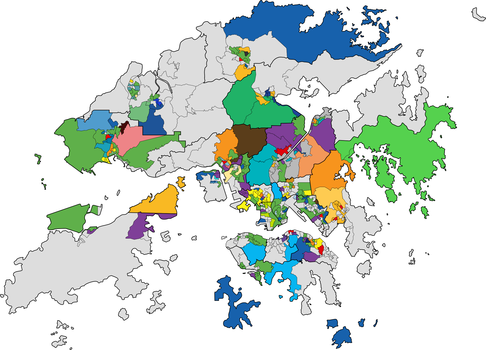

--- 
title: "Hong Kong Data Book"
author: "Hong Kong Districts Info"
date: "`r Sys.Date()`"
site: bookdown::bookdown_site
output: bookdown::gitbook
documentclass: book
# bibliography: [book.bib, packages.bib]
# biblio-style: apalike
link-citations: yes
github-repo: hong-kong-districts-info/hkdatabook
description: "This is a collaborative book for documenting the data sources for working with projects that are related to Hong Kong."
---

```{r}

```

# Introduction

This book is written _for_ (and hopefully in time, _by_) anyone who is interested in working with Hong Kong related data: researchers, analysts, journalists, students, data scientists, etc. This book / project is for you, if you are trying to answer the following questions:

- Where can I find open data sets or APIs in domain _X_? 
- What open data sets already exist out there about domain _X_?
- Who are the maintainers of open datasets or APIs in domain _X_?

Of course, any subject with regard to domain _X_ should relate to topics in Hong Kong.  

This project may seem an ambitious attempt in terms of _scope_, as there is plenty that is out there. However, the belief here is that **crowd-sourcing** would offer a solution here, as it has done for tremendously successful projects like **Wikipedia**, and generally other open-source communities like those for **R** and **Python**. 

## Contributing

This is a collaborative book. What this means is that anyone is welcome to submit changes to the book. For more information on how to contribute, please visit <https://github.com/Hong-Kong-Districts-Info/hkdatabook>.

We accept anything that falls under the below categories:

- free-to-use data sets
- free-to-use APIs (at least to an extent)
- packages or libraries
- organizations or groups promoting any of the above

## About Hong Kong Districts Info

This book project was created by the [Hong Kong Districts Info](https://hong-kong-districts-info.github.io/) group. 

Our vision of Hong Kong Districts Info is to establish a learning and collaboration community to bring together people who are interested in:

- Learning and developing new skills, and
- Want real, impactful projects to work on

Hong Kong Districts Info provides for such an environment where aspiring developers, artists, content creators, etc. can collaborate on Hong Kong district themed projects to establish their portfolio, promote their work, collaborate on open-source projects and make a positive impact.

As the founders of this platform, we would participate in certain projects ourselves, but would also help connect and coordinate individuals so they can collaborate and publish work under our platform.

If you are someone who is looking to build and expand their first coding, design, data science project, or website/app portfolio, and if you are looking to practice your skills on a meaningful, open-source project, you have come to the right place. From our base, we hope to provide mentoring to those who do not have the skills, but want to learn them.

